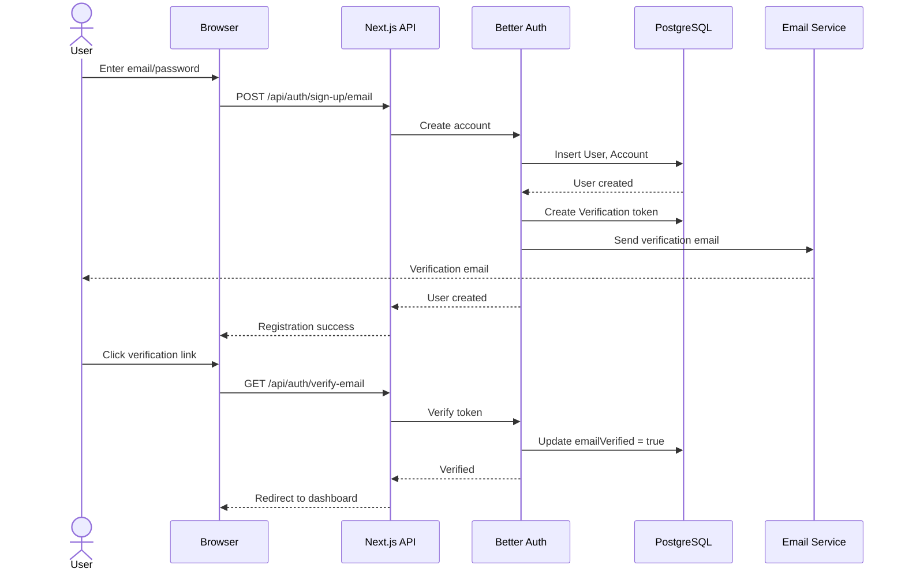
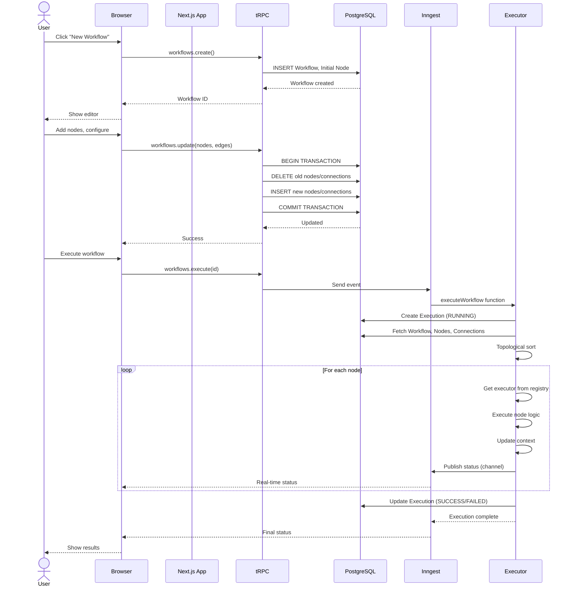
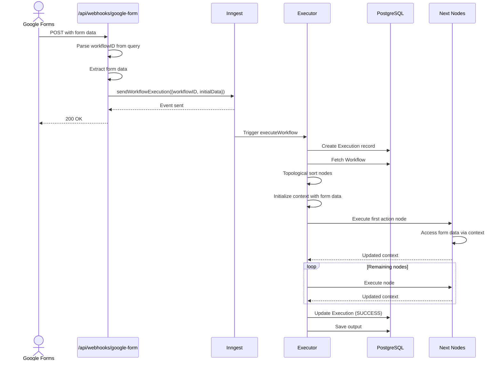
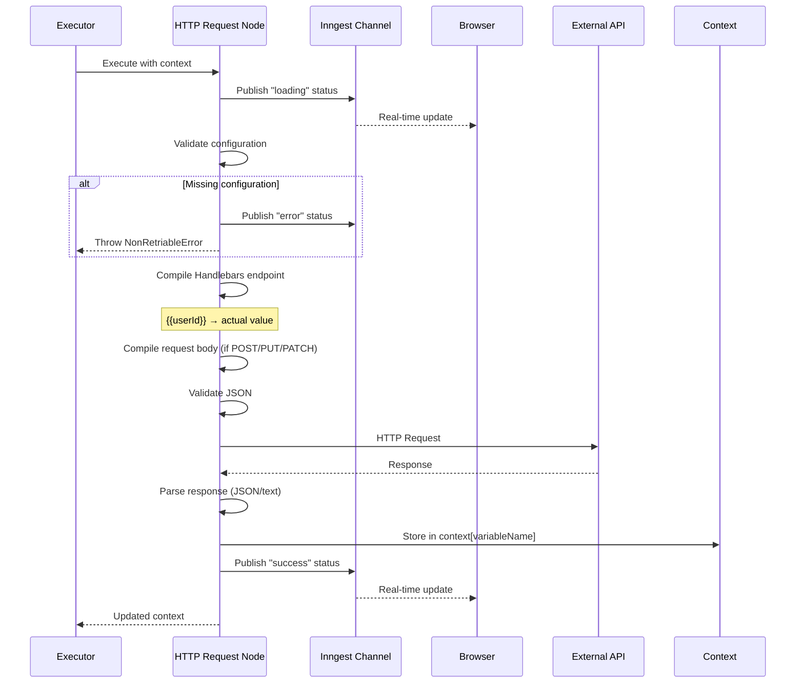
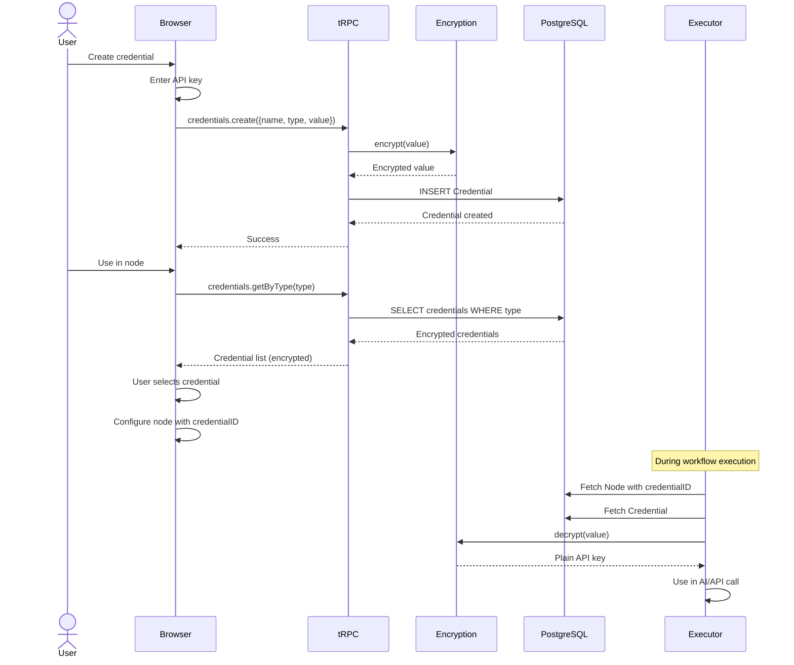
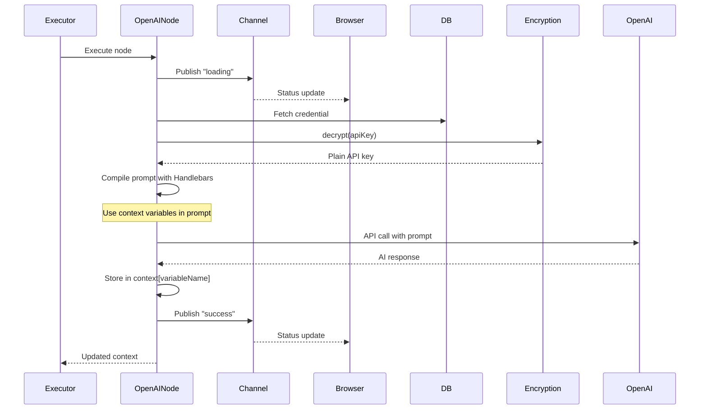

# Spectrum - AI Workflow Automation Platform

Spectrum is a self-hosted workflow automation platform built with Next.js, tRPC, Prisma, AI SDK, and Inngest. It allows users to create, manage, and execute complex workflows with various triggers, actions, and AI integrations.

Editor

Node Selector

Credentials

Execution Status 
Error Log 
Output Log
  

## Features

- **Visual Workflow Editor**: Drag-and-drop interface built with React Flow for creating complex automation workflows
- **Multiple Triggers**: Support for manual triggers, webhooks (Google Forms, Stripe, PayPal)
- **AI Integrations**: Built-in support for OpenAI, Anthropic Claude, and Google Gemini
- **Communication Actions**: Send messages to Discord and Slack
- **HTTP Requests**: Make API calls with dynamic data and Handlebars templating
- **Credential Management**: Secure storage of API keys and credentials with encryption
- **Execution History**: Track and monitor workflow executions with detailed logs
- **Real-time Updates**: Live status updates during workflow execution using Inngest channels
- **Authentication**: Email/password and OAuth (GitHub, Google) via Better Auth
- **Error Monitoring**: Integrated Sentry for error tracking and debugging

## Table of Contents

- [Technology Stack](#technology-stack)
- [Project Structure](#project-structure)
- [Sequence Diagrams](#sequence-diagrams)
- [Database Schema](#database-schema)
- [API Endpoints](#api-endpoints)
- [tRPC Routers](#trpc-routers)
- [Core Components](#core-components)
- [Features & Modules](#features--modules)
- [Workflow Execution](#workflow-execution)
- [Library Functions](#library-functions)
- [Getting Started](#getting-started)
- [Environment Variables](#environment-variables)
- [Scripts](#scripts)

## Technology Stack

| Category | Technology | Description |
|----------|------------|-------------|
| **Core** | Next.js 16 | React framework with App Router and Server Components |
| | TypeScript | Type-safe development |
| | Prisma | Database ORM with PostgreSQL |
| | tRPC | End-to-end typesafe API layer |
| | React 19.2 | UI library |
| **State & Data** | TanStack Query | Server state management |
| | Jotai | Atomic state management |
| | Zod | Schema validation |
| | SuperJSON | JSON serialization with type preservation |
| **Workflow Engine** | Inngest | Durable workflow execution engine |
| | @xyflow/react | Visual workflow editor |
| | Handlebars | Template engine for dynamic data |
| **AI & Integrations** | @ai-sdk/openai | OpenAI integration |
| | @ai-sdk/anthropic | Claude integration |
| | @ai-sdk/google | Google Gemini integration |
| **Auth & Security** | Better Auth | Modern authentication solution |
| | Cryptr | Encryption for sensitive credentials |
| **UI & Styling** | Tailwind CSS | Utility-first CSS framework |
| | Radix UI | Accessible component primitives |
| | Lucide React | Icon library |
| | Sonner | Toast notifications |
| **Developer Tools** | ESLint | Code linting |
| | Sentry | Error tracking |
| | mprocs | Process manager for development |

## Project Structure

```
spectrum/
├── prisma/
│   ├── schema.prisma           # Database schema definition
│   └── migrations/             # Database migration files
├── public/                     # Static assets
├── src/
│   ├── app/                    # Next.js App Router
│   │   ├── (auth)/            # Authentication pages
│   │   ├── (dashboard)/       # Main application pages
│   │   └── api/               # API routes
│   │       ├── auth/          # Authentication endpoints
│   │       ├── inngest/       # Inngest function handler
│   │       ├── trpc/          # tRPC API handler
│   │       └── webhooks/      # Webhook receivers
│   ├── components/            # React components
│   ├── config/               # Configuration files
│   ├── features/             # Feature modules
│   │   ├── auth/
│   │   ├── credentials/
│   │   ├── editor/
│   │   ├── executions/
│   │   ├── triggers/
│   │   └── workflows/
│   ├── hooks/                # Custom React hooks
│   ├── inngest/              # Workflow execution logic
│   │   ├── channels/         # Real-time status channels
│   │   ├── client.ts         # Inngest client setup
│   │   ├── functions.ts      # Workflow execution function
│   │   └── utils.ts          # Utility functions
│   ├── lib/                  # Shared utilities
│   └── trpc/                 # tRPC setup
└── package.json
```

## Sequence Diagrams

### 1. User Authentication Flow



### 2. Workflow Creation & Execution



### 3. Webhook Trigger Flow (Google Forms)



### 4. HTTP Request Node Execution



### 5. Credential Management



### 6. AI Node Execution (OpenAI Example)




## Database Schema

### User Management

#### User
**Purpose:** Stores user account information

| Field | Type | Constraints | Description |
|-------|------|-------------|-------------|
| `id` | String | Primary Key | Unique user identifier |
| `name` | String | Required | User's display name |
| `email` | String | Required, Unique | User's email address |
| `emailVerified` | Boolean | Default: false | Email verification status |
| `image` | String | Nullable | Profile picture URL |
| `createdAt` | DateTime | Default: now() | Account creation timestamp |
| `updatedAt` | DateTime | Auto-update | Last update timestamp |

**Relations:**

| Relation | Type | Model | Description |
|----------|------|-------|-------------|
| `sessions` | One-to-Many | Session | User authentication sessions |
| `accounts` | One-to-Many | Account | Connected OAuth accounts |
| `workflows` | One-to-Many | Workflow | User-created workflows |
| `credentials` | One-to-Many | Credential | Stored API credentials |

#### Session
**Purpose:** Manages user authentication sessions

| Field | Type | Constraints | Description |
|-------|------|-------------|-------------|
| `id` | String | Primary Key | Session identifier |
| `token` | String | Required, Unique | Session token |
| `expiresAt` | DateTime | Required | Expiration timestamp |
| `ipAddress` | String | Nullable | Client IP address |
| `userAgent` | String | Nullable | Client user agent string |
| `userId` | String | Foreign Key | Reference to User |
| `createdAt` | DateTime | Default: now() | Session creation timestamp |
| `updatedAt` | DateTime | Auto-update | Last update timestamp |

**Relations:**

| Relation | Type | Model | Description |
|----------|------|-------|-------------|
| `user` | Many-to-One | User | Session owner (Cascade delete) |

#### Account
**Purpose:** Stores OAuth provider accounts and credentials

| Field | Type | Constraints | Description |
|-------|------|-------------|-------------|
| `id` | String | Primary Key | Account identifier |
| `accountId` | String | Required | Provider-specific account ID |
| `providerId` | String | Required | OAuth provider identifier |
| `accessToken` | String | Nullable | OAuth access token |
| `refreshToken` | String | Nullable | OAuth refresh token |
| `idToken` | String | Nullable | OAuth ID token |
| `accessTokenExpiresAt` | DateTime | Nullable | Access token expiration |
| `refreshTokenExpiresAt` | DateTime | Nullable | Refresh token expiration |
| `scope` | String | Nullable | OAuth scope permissions |
| `password` | String | Nullable | Hashed password (email/password auth) |
| `userId` | String | Foreign Key | Reference to User |
| `createdAt` | DateTime | Default: now() | Account creation timestamp |
| `updatedAt` | DateTime | Auto-update | Last update timestamp |

**Relations:**

| Relation | Type | Model | Description |
|----------|------|-------|-------------|
| `user` | Many-to-One | User | Account owner (Cascade delete) |

#### Verification
**Purpose:** Handles email verification and password reset tokens

| Field | Type | Constraints | Description |
|-------|------|-------------|-------------|
| `id` | String | Primary Key | Verification identifier |
| `identifier` | String | Required | Email or user identifier |
| `value` | String | Required | Verification code/token |
| `expiresAt` | DateTime | Required | Token expiration timestamp |
| `createdAt` | DateTime | Default: now() | Token creation timestamp |
| `updatedAt` | DateTime | Auto-update | Last update timestamp |

### Workflow System

#### Workflow
**Purpose:** Represents an automation workflow

| Field | Type | Constraints | Description |
|-------|------|-------------|-------------|
| `id` | String | Primary Key, CUID | Workflow identifier |
| `name` | String | Required | Workflow name |
| `userId` | String | Foreign Key | Owner reference |
| `createdAt` | DateTime | Default: now() | Workflow creation timestamp |
| `updatedAt` | DateTime | Auto-update | Last update timestamp |

**Relations:**

| Relation | Type | Model | Description |
|----------|------|-------|-------------|
| `user` | Many-to-One | User | Workflow owner (Cascade delete) |
| `nodes` | One-to-Many | Node | Workflow nodes/steps |
| `connections` | One-to-Many | Connection | Node connections |
| `executions` | One-to-Many | Execution | Execution history |

#### Node
**Purpose:** Individual steps in a workflow

| Field | Type | Constraints | Description |
|-------|------|-------------|-------------|
| `id` | String | Primary Key, CUID | Node identifier |
| `workflowID` | String | Foreign Key | Parent workflow reference |
| `name` | String | Required | Node display name |
| `type` | NodeType | Enum, Required | Node type |
| `position` | JSON | Required | Visual position `{x, y}` |
| `data` | JSON | Default: {} | Node configuration data |
| `credentialID` | String | Foreign Key, Nullable | Associated credential |
| `createdAt` | DateTime | Default: now() | Node creation timestamp |
| `updatedAt` | DateTime | Auto-update | Last update timestamp |

**NodeType Enum Values:**

| Value | Description |
|-------|-------------|
| `INITIAL` | Initial/starting node |
| `MANUAL_TRIGGER` | Manual execution trigger |
| `HTTP_REQUEST` | HTTP API request |
| `GOOGLE_FORM_TRIGGER` | Google Forms webhook |
| `PAYMENT_TRIGGER` | Stripe payment webhook |
| `PAYPAL_TRIGGER` | PayPal webhook |
| `ANTHROPIC` | Claude AI integration |
| `GOOGLE_GEMINI` | Google Gemini AI |
| `OPENAI` | OpenAI integration |
| `DISCORD` | Discord message action |
| `SLACK` | Slack message action |

**Relations:**

| Relation | Type | Model | Description |
|----------|------|-------|-------------|
| `workflow` | Many-to-One | Workflow | Parent workflow (Cascade delete) |
| `outputConnections` | One-to-Many | Connection | Outgoing connections |
| `inputConnections` | One-to-Many | Connection | Incoming connections |
| `credential` | Many-to-One | Credential | Associated credential (Optional) |

#### Connection
**Purpose:** Connects nodes to define workflow flow

| Field | Type | Constraints | Description |
|-------|------|-------------|-------------|
| `id` | String | Primary Key, CUID | Connection identifier |
| `workflowID` | String | Foreign Key | Parent workflow reference |
| `fromNodeID` | String | Foreign Key | Source node reference |
| `toNodeID` | String | Foreign Key | Target node reference |
| `fromOutput` | String | Default: "main" | Output handle name |
| `toInput` | String | Default: "main" | Input handle name |
| `createdAt` | DateTime | Default: now() | Connection creation timestamp |
| `updatedAt` | DateTime | Auto-update | Last update timestamp |

**Unique Constraint:** `[fromNodeID, toNodeID, fromOutput, toInput]`

**Relations:**

| Relation | Type | Model | Description |
|----------|------|-------|-------------|
| `workflow` | Many-to-One | Workflow | Parent workflow (Cascade delete) |
| `fromNode` | Many-to-One | Node | Source node (Cascade delete) |
| `toNode` | Many-to-One | Node | Target node (Cascade delete) |

#### Credential
**Purpose:** Stores encrypted API keys and credentials

| Field | Type | Constraints | Description |
|-------|------|-------------|-------------|
| `id` | String | Primary Key, CUID | Credential identifier |
| `name` | String | Required | Credential display name |
| `value` | String | Required | Encrypted credential value |
| `type` | CredentialType | Enum, Required | Credential type |
| `userId` | String | Foreign Key | Owner reference |
| `createdAt` | DateTime | Default: now() | Credential creation timestamp |
| `updatedAt` | DateTime | Auto-update | Last update timestamp |

**CredentialType Enum Values:**

| Value | Description |
|-------|-------------|
| `OPENAI` | OpenAI API key |
| `ANTHROPIC` | Anthropic Claude API key |
| `GOOGLE_GEMINI` | Google Gemini API key |

**Relations:**

| Relation | Type | Model | Description |
|----------|------|-------|-------------|
| `user` | Many-to-One | User | Credential owner (Cascade delete) |
| `Node` | One-to-Many | Node | Nodes using this credential |

#### Execution
**Purpose:** Tracks workflow execution history

| Field | Type | Constraints | Description |
|-------|------|-------------|-------------|
| `id` | String | Primary Key, CUID | Execution identifier |
| `workflowID` | String | Foreign Key | Executed workflow reference |
| `inngestEventID` | String | Required, Unique | Inngest event ID for tracking |
| `status` | ExecutionStatus | Enum, Default: RUNNING | Current execution status |
| `startedAt` | DateTime | Default: now() | Execution start timestamp |
| `completedAt` | DateTime | Nullable | Execution completion timestamp |
| `output` | JSON | Nullable | Execution result data |
| `error` | String (Text) | Nullable | Error message if failed |
| `errorStack` | String (Text) | Nullable | Error stack trace if failed |

**ExecutionStatus Enum Values:**

| Value | Description |
|-------|-------------|
| `RUNNING` | Execution in progress |
| `SUCCESS` | Execution completed successfully |
| `FAILED` | Execution failed with error |

**Indexes:**

| Index | Fields | Description |
|-------|--------|-------------|
| Primary | `[workflowID, startedAt DESC]` | Optimized for execution history queries |

**Relations:**

| Relation | Type | Model | Description |
|----------|------|-------|-------------|
| `workflow` | Many-to-One | Workflow | Executed workflow (Cascade delete) |

## API Endpoints

| Endpoint | Method | File | Description |
|----------|--------|------|-------------|
| `/api/auth/[...all]` | GET, POST | [src/app/api/auth/[...all]/route.ts](src/app/api/auth/[...all]/route.ts) | Authentication operations via Better Auth |
| `/api/auth/sign-in/email` | POST | (via Better Auth) | Email/password sign-in |
| `/api/auth/sign-up/email` | POST | (via Better Auth) | User registration |
| `/api/auth/session` | GET | (via Better Auth) | Get current session |
| `/api/auth/sign-out` | POST | (via Better Auth) | Sign out |
| `/api/auth/oauth/{provider}` | GET | (via Better Auth) | OAuth login (GitHub, Google) |
| `/api/auth/forgot-password` | POST | (via Better Auth) | Request password reset |
| `/api/auth/reset-password` | POST | (via Better Auth) | Reset password with token |
| `/api/auth/verify-email` | POST | (via Better Auth) | Verify email address |
| `/api/trpc/[trpc]` | GET, POST | [src/app/api/trpc/[trpc]/route.ts](src/app/api/trpc/[trpc]/route.ts) | Main tRPC API endpoint for all procedures |
| `/api/inngest` | GET, POST, PUT | [src/app/api/inngest/route.ts](src/app/api/inngest/route.ts) | Inngest functions for workflow execution |
| `/api/webhooks/google-form` | POST | [src/app/api/webhooks/google-form/route.ts](src/app/api/webhooks/google-form/route.ts) | Receives Google Form submissions |
| `/api/webhooks/stripe` | POST | [src/app/api/webhooks/stripe/route.ts](src/app/api/webhooks/stripe/route.ts) | Receives Stripe events |
| `/api/webhooks/paypal` | POST | [src/app/api/webhooks/paypal/route.ts](src/app/api/webhooks/paypal/route.ts) | Receives PayPal events |

### Webhook Configuration

All webhook endpoints require a `workflowID` query parameter and return:
- `200 OK` - Event processed successfully
- `400 Bad Request` - Missing workflowID
- `500 Internal Server Error` - Processing failed

## tRPC Routers

### Main Router - `appRouter`
**File:** [src/trpc/routers/_app.ts](src/trpc/routers/_app.ts)

Combines all feature routers.

**Structure:**
```typescript
export const appRouter = createTRPCRouter({
    workflows: workflowsRouter,
    credentials: credentialsRouter,
    executions: executionsRouter,
});
```

### Workflows Router
**File:** [src/features/workflows/server/router.ts](src/features/workflows/server/router.ts)

Manages workflow CRUD operations.

#### Procedures:

**`workflows.execute`** - Execute a workflow
- **Input:** `{ id: string }`
- **Type:** Mutation (Protected)
- **Returns:** Workflow object
- **Functionality:** Validates ownership and sends execution event to Inngest

**`workflows.create`** - Create new workflow
- **Type:** Mutation (Protected)
- **Returns:** Created workflow with initial node
- **Functionality:** 
  - Generates random slug name
  - Creates workflow with INITIAL node at (0, 0)
  - Associates with current user

**`workflows.remove`** - Delete workflow
- **Input:** `{ id: string }`
- **Type:** Mutation (Protected)
- **Returns:** Deleted workflow
- **Functionality:** Validates ownership before deletion

**`workflows.update`** - Update workflow structure
- **Input:**
  ```typescript
  {
      id: string;
      nodes: Array<{
          id: string;
          type?: string;
          position: { x: number; y: number };
          data?: Record<string, any>;
      }>;
      edges: Array<{
          source: string;
          target: string;
          sourceHandle?: string;
          targetHandle?: string;
      }>;
  }
  ```
- **Type:** Mutation (Protected)
- **Returns:** Updated workflow
- **Functionality:**
  - Uses database transaction for consistency
  - Deletes all existing nodes/connections
  - Creates new nodes and connections
  - Updates workflow timestamp

**`workflows.updateName`** - Rename workflow
- **Input:** `{ id: string; name: string }`
- **Type:** Mutation (Protected)
- **Returns:** Updated workflow
- **Validation:** Name must be at least 1 character

**`workflows.getOne`** - Fetch single workflow
- **Input:** `{ id: string }`
- **Type:** Query (Protected)
- **Returns:** 
  ```typescript
  {
      id: string;
      name: string;
      nodes: Node[];  // React Flow format
      edges: Edge[];  // React Flow format
  }
  ```
- **Functionality:** Transforms database format to React Flow format

**`workflows.getMany`** - List workflows with pagination
- **Input:**
  ```typescript
  {
      page?: number;        // Default: 1
      pageSize?: number;    // Default: 10, Range: 5-50
      search?: string;      // Default: ""
  }
  ```
- **Type:** Query (Protected)
- **Returns:**
  ```typescript
  {
      items: Workflow[];
      page: number;
      pageSize: number;
      totalCount: number;
      totalPages: number;
      hasNextPage: boolean;
      hasPrevPage: boolean;
  }
  ```
- **Functionality:**
  - Filters by workflow name (case-insensitive)
  - Orders by updatedAt DESC
  - Includes pagination metadata

### Credentials Router
**File:** [src/features/credentials/server/router.ts](src/features/credentials/server/router.ts)

Manages API credentials and keys.

#### Procedures:

**`credentials.create`** - Create credential
- **Input:**
  ```typescript
  {
      name: string;
      type: "OPENAI" | "ANTHROPIC" | "GOOGLE_GEMINI";
      value: string;
  }
  ```
- **Type:** Mutation (Protected)
- **Returns:** Created credential
- **Functionality:** Encrypts value before storage

**`credentials.remove`** - Delete credential
- **Input:** `{ id: string }`
- **Type:** Mutation (Protected)
- **Returns:** Deleted credential

**`credentials.update`** - Update credential
- **Input:**
  ```typescript
  {
      id: string;
      name: string;
      type: "OPENAI" | "ANTHROPIC" | "GOOGLE_GEMINI";
      value: string;
  }
  ```
- **Type:** Mutation (Protected)
- **Returns:** Updated credential
- **Functionality:** Re-encrypts new value

**`credentials.getOne`** - Fetch single credential
- **Input:** `{ id: string }`
- **Type:** Query (Protected)
- **Returns:** Credential (with encrypted value)

**`credentials.getMany`** - List credentials with pagination
- **Input:**
  ```typescript
  {
      page?: number;
      pageSize?: number;
      search?: string;  // Searches name field
  }
  ```
- **Type:** Query (Protected)
- **Returns:** Paginated credential list
- **Functionality:** Case-insensitive name search

**`credentials.getByType`** - Get credentials by type
- **Input:** `{ type: "OPENAI" | "ANTHROPIC" | "GOOGLE_GEMINI" }`
- **Type:** Query (Protected)
- **Returns:** Array of matching credentials
- **Functionality:** Orders by updatedAt DESC

### Executions Router
**File:** [src/features/executions/server/router.ts](src/features/executions/server/router.ts)

Provides execution history and details.

#### Procedures:

**`executions.getOne`** - Fetch single execution
- **Input:** `{ id: string }`
- **Type:** Query (Protected)
- **Returns:** Execution with workflow details
- **Includes:** `workflow: { id, name }`

**`executions.getMany`** - List executions with pagination
- **Input:**
  ```typescript
  {
      page?: number;
      pageSize?: number;
  }
  ```
- **Type:** Query (Protected)
- **Returns:** Paginated execution list
- **Functionality:**
  - Orders by startedAt DESC
  - Includes workflow name and ID
  - Only shows user's workflow executions

## Core Components

### App Layout Components

#### AppHeader
**File:** [src/components/app-header.tsx](src/components/app-header.tsx)

**Purpose:** Top navigation bar with sidebar toggle.

**Features:**
- Sidebar trigger button
- Fixed height (h-14)
- Bottom border for visual separation

#### AppSidebar
**File:** [src/components/app-sidebar.tsx](src/components/app-sidebar.tsx)

**Purpose:** Main navigation sidebar.

**Menu Items:**
- **Workflows** (`/workflows`) - Manage automation workflows
- **Credentials** (`/credentials`) - Store API keys
- **Executions** (`/executions`) - View execution history

**Features:**
- Collapsible to icon-only mode
- Active route highlighting
- User profile in footer
- Sign-out functionality
- Spectrum branding with logo

**State:**
- Uses `usePathname()` for active route detection
- Client component for interactivity

### Workflow Editor Components

#### WorkflowNode
**File:** [src/components/workflow-node.tsx](src/components/workflow-node.tsx)

**Purpose:** Wrapper component for React Flow nodes.

**Props:**
```typescript
{
    children: ReactNode;
    showToolbar?: boolean;      // Default: true
    onDelete?: () => void;
    onSettings?: () => void;
    name?: string;              // Node display name
    description?: string;       // Node description
}
```

**Features:**
- **Top Toolbar** (when `showToolbar=true`):
  - Settings button (gear icon)
  - Delete button (trash icon)
- **Bottom Toolbar** (when `name` provided):
  - Node name display
  - Description (expandable on hover)
- Consistent styling across all node types

#### InitialNode
**File:** [src/components/initial-node.tsx](src/components/initial-node.tsx)

**Purpose:** Starting point of every workflow.

**Characteristics:**
- Non-deletable
- No settings
- Minimal configuration
- Serves as workflow entry point

#### NodeSelector
**File:** [src/components/node-selector.tsx](src/components/node-selector.tsx)

**Purpose:** Node palette for adding nodes to workflow.

**Features:**
- Categorized node list
- Search/filter functionality
- Drag-and-drop to canvas
- Node type descriptions

### Entity Components
**File:** [src/components/entity-components.tsx](src/components/entity-components.tsx)

**Purpose:** Reusable components for entity management (workflows, credentials, executions).

**Includes:**
- List views
- Table components
- Action buttons
- Status badges

## Features & Modules

### Editor Module
**Directory:** [src/features/editor/](src/features/editor/)

**Purpose:** Visual workflow editor implementation.

**Key Files:**
- `store/atoms.ts` - Jotai atoms for editor state
- Component-level state management
- Canvas interactions
- Node positioning

### Workflows Module
**Directory:** [src/features/workflows/](src/features/workflows/)

**Components:**
- `params.ts` - URL parameter definitions
- `hooks/use-workflows.ts` - Workflow CRUD hooks
- `hooks/use-workflows-params.ts` - URL parameter hooks
- `server/router.ts` - tRPC router (documented above)
- `server/params-loader.ts` - Server-side parameter loading
- `server/prefetch.ts` - Data prefetching utilities

### Credentials Module
**Directory:** [src/features/credentials/](src/features/credentials/)

**Purpose:** Secure credential storage and management.

**Features:**
- Encrypted storage
- Type-based organization
- CRUD operations
- Credential selection for nodes

### Executions Module
**Directory:** [src/features/executions/](src/features/executions/)

**Purpose:** Workflow execution engine and monitoring.

**Key Files:**

#### Executor Registry
**File:** [src/features/executions/lib/executor-registry.ts](src/features/executions/lib/executor-registry.ts)

**Purpose:** Maps node types to executor functions.

**Registry:**
```typescript
{
    INITIAL: manualTriggerExecutor,
    MANUAL_TRIGGER: manualTriggerExecutor,
    HTTP_REQUEST: httpRequestExecutor,
    GOOGLE_FORM_TRIGGER: googleFromTriggerExecutor,
    PAYMENT_TRIGGER: paymentTriggerExecutor,
    PAYPAL_TRIGGER: paypalTriggerExecutor,
    GOOGLE_GEMINI: googleGeminiExecutor,
    ANTHROPIC: anthropicExecutor,
    OPENAI: OpenAIExecutor,
    DISCORD: DiscordExecutor,
    SLACK: SlackExecutor,
}
```

**Function:** `getExecutor(type: NodeType): NodeExecutor`
- Retrieves executor for given node type
- Throws error if executor not found

#### Node Components
**File:** [src/config/node-coponents.ts](src/config/node-coponents.ts)

**Purpose:** Maps node types to React components.

**Components:**
- `INITIAL` → InitialNode
- `HTTP_REQUEST` → HttpRequestNode
- `MANUAL_TRIGGER` → ManualTriggerNode
- `GOOGLE_FORM_TRIGGER` → GoogleFormTriggerNode
- `PAYMENT_TRIGGER` → PaymentTriggerNode
- `PAYPAL_TRIGGER` → PayPalTriggerNode
- `GOOGLE_GEMINI` → GoogleGeminiNode
- `OPENAI` → OpenAINode
- `ANTHROPIC` → AnthropicNode
- `DISCORD` → DiscordNode
- `SLACK` → SlackNode

#### HTTP Request Executor
**File:** [src/features/executions/components/http-request/executor.ts](src/features/executions/components/http-request/executor.ts)

**Purpose:** Makes HTTP requests with dynamic data.

**Configuration:**
```typescript
{
    variableName: string;     // Context variable name for response
    endpoint: string;         // URL with Handlebars templates
    method: "GET" | "POST" | "PUT" | "PATCH" | "DELETE";
    body?: string;           // JSON body with Handlebars templates
}
```

**Features:**
- **Handlebars Templating:** Dynamic endpoint and body
  - Example: `https://api.example.com/users/{{userId}}`
- **Context Variables:** Store response in context
- **JSON Validation:** Prevents invalid JSON in POST/PUT/PATCH
- **Content Type Detection:** Handles JSON and text responses
- **Real-time Status:** Publishes loading/error states via channels

**Response Format:**
```typescript
{
    [variableName]: {
        httpResponse: {
            status: number;
            statusText: string;
            data: any;  // JSON or text
        }
    }
}
```

**Custom Handlebars Helper:**
- `{{JSON context}}` - Stringifies objects for templates

### Triggers Module
**Directory:** [src/features/triggers/](src/features/triggers/)

**Purpose:** Workflow trigger implementations.

**Trigger Types:**

#### Manual Trigger
- User-initiated execution
- No external dependencies
- Used by INITIAL node

#### Google Form Trigger
- Receives form submissions via webhook
- Parses form responses
- Extracts respondent email

#### Payment Trigger (Stripe)
- Receives Stripe events
- Handles payment lifecycle
- Supports all Stripe event types

#### PayPal Trigger
- Receives PayPal webhooks
- Handles transaction events
- Supports PayPal event types

**Common Pattern:**
Each trigger has:
- `executor.ts` - Execution logic
- `actions.ts` - Node configuration UI
- `node.tsx` - React Flow node component
- `utils.ts` (optional) - Helper functions

## Workflow Execution

### Inngest Functions
**File:** [src/inngest/functions.ts](src/inngest/functions.ts)

#### executeWorkflow Function

**Event:** `workflows/execute.workflow`

**Purpose:** Orchestrates workflow execution with fault tolerance.

**Configuration:**
- **Retries:** 1 (production), 0 (development)
- **Failure Handler:** Updates execution status to FAILED

**Execution Flow:**

1. **Create Execution Record**
   - Step: `create-execution-history`
   - Creates database record with RUNNING status
   - Stores Inngest event ID for tracking

2. **Prepare Workflow**
   - Step: `prepare-workflow`
   - Fetches workflow with nodes and connections
   - Performs topological sort for execution order
   - Detects cycles (throws NonRetriableError)

3. **Find User ID**
   - Step: `find-user-id`
   - Retrieves workflow owner
   - Used for credential access

4. **Execute Nodes**
   - Iterates through sorted nodes
   - Gets executor from registry
   - Passes context between nodes
   - Each node can modify context

5. **Update Execution Record**
   - Step: `update-execution-history`
   - Sets status to SUCCESS
   - Records completion time
   - Stores final output

**Context Flow:**
- Initialized with `initialData` from trigger
- Each node receives current context
- Each node returns updated context
- Final context stored as execution output

**Real-time Channels:**
- HTTP Request status
- Manual Trigger status
- Google Form Trigger status
- Payment Trigger status
- PayPal Trigger status
- AI model execution status (OpenAI, Anthropic, Gemini)
- Communication status (Discord, Slack)

### Inngest Client
**File:** [src/inngest/client.ts](src/inngest/client.ts)

**Configuration:**
```typescript
{
    id: "spectrum",
    middleware: [realtimeMiddleware()],
    eventKey: process.env.INNGEST_EVENT_KEY
}
```

**Purpose:**
- Send workflow execution events
- Real-time status updates
- Durable execution guarantees

### Inngest Utilities
**File:** [src/inngest/utils.ts](src/inngest/utils.ts)

#### topologicalSort Function

**Purpose:** Determines node execution order.

**Parameters:**
- `nodes: Node[]` - All workflow nodes
- `connections: Connection[]` - Node connections

**Returns:** `Node[]` - Sorted nodes

**Algorithm:**
1. Convert connections to edges: `[fromNodeID, toNodeID]`
2. Add self-edges for disconnected nodes
3. Run toposort algorithm
4. Remove duplicate IDs
5. Map IDs back to node objects

**Error Handling:**
- Detects cycles → `NonRetriableError`
- Ensures valid execution order

#### sendWorkflowExecution Function

**Purpose:** Triggers workflow execution.

**Parameters:**
```typescript
{
    workflowID: string;
    initialData?: any;
    [key: string]: any;
}
```

**Returns:** Inngest event send promise

**Functionality:**
- Sends `workflows/execute.workflow` event
- Generates unique CUID event ID
- Passes initial data to workflow context

### Inngest Channels
**Directory:** [src/inngest/channels/](src/inngest/channels/)

**Purpose:** Real-time status updates during execution.

**Channel Files:**
- `http-request.ts` - HTTP request progress
- `manual-trigger.ts` - Manual execution status
- `google-form-trigger.ts` - Form submission processing
- `payment-trigger.ts` - Payment event handling
- `paypal-trigger.ts` - PayPal event handling
- `google-gemini.ts` - Gemini AI execution
- `openai.ts` - OpenAI execution
- `anthropic.ts` - Claude execution
- `discord.ts` - Discord message sending
- `slack.ts` - Slack message sending

**Common Status Values:**
- `loading` - In progress
- `success` - Completed successfully
- `error` - Execution failed

## Library Functions

### Authentication - [src/lib/auth.ts](src/lib/auth.ts)

**Purpose:** Configure Better Auth for user authentication and session management

| Configuration | Description |
|---------------|-------------|
| `database` | Uses Prisma adapter with PostgreSQL |
| `emailAndPassword.enabled` | Enable email/password authentication |
| `emailAndPassword.autoSignIn` | Automatically sign in after registration |
| `emailAndPassword.requireEmailVerification` | Require email verification before access |
| `emailVerification.sendOnSignUp` | Send verification email on registration |
| `socialProviders.github` | GitHub OAuth integration |
| `socialProviders.google` | Google OAuth integration |
| `user.deleteUser.enabled` | Enable account deletion with verification |

| Function/Feature | Description |
|------------------|-------------|
| `sendResetPassword` | Sends password reset email with verification link |
| `sendVerificationEmail` | Sends email verification link to new users |
| `sendDeleteAccountVerification` | Sends confirmation email for account deletion |
| `mapProfileToUser` (GitHub) | Maps GitHub profile data to user schema |
| `mapProfileToUser` (Google) | Maps Google profile data to user schema |

### Database Client - [src/lib/db.ts](src/lib/db.ts)

**Purpose:** Provide singleton Prisma client instance for database operations

| Export | Type | Description |
|--------|------|-------------|
| `prisma` | PrismaClient | Singleton Prisma client instance |

| Feature | Description |
|---------|-------------|
| Global instance | Prevents multiple Prisma clients in development |
| Hot module reload safe | Preserves client across Next.js hot reloads |
| Production ready | Creates new instance only when needed |

### Encryption - [src/lib/encryption.ts](src/lib/encryption.ts)

**Purpose:** Encrypt and decrypt sensitive credentials using AES-256

| Function | Parameters | Returns | Description |
|----------|------------|---------|-------------|
| `encrypt` | `text: string` | `string` | Encrypts plain text using AES-256 via Cryptr |
| `decrypt` | `text: string` | `string` | Decrypts encrypted text back to plain text |

| Configuration | Description |
|---------------|-------------|
| Algorithm | AES-256 encryption via Cryptr library |
| Encryption Key | `process.env.ENCRYPTION_KEY` |

### Authentication Client - [src/lib/auth-client.ts](src/lib/auth-client.ts)

**Purpose:** Provide client-side authentication utilities and hooks

| Export | Type | Description |
|--------|------|-------------|
| `authClient` | BetterAuthClient | Better Auth client instance for browser |

| Feature | Description |
|---------|-------------|
| Session management hooks | React hooks for accessing current session |
| OAuth redirect handlers | Handle OAuth callback and redirect logic |
| Client-side auth state | Manage authentication state in browser |

### Email Service - [src/lib/email.ts](src/lib/email.ts)

**Purpose:** Send transactional emails via Nodemailer

| Function | Parameters | Returns | Description |
|----------|------------|---------|-------------|
| `sendEmail` | `{ to, subject, text, html }` | `Promise<void>` | Sends email using Nodemailer with SMTP configuration |

| Parameter | Type | Description |
|-----------|------|-------------|
| `to` | `string` | Recipient email address |
| `subject` | `string` | Email subject line |
| `text` | `string` | Plain text email body |
| `html` | `string` | HTML email body |

| Configuration | Description |
|---------------|-------------|
| Provider | Nodemailer with SMTP |
| SMTP Settings | From environment variables (EMAIL_HOST, EMAIL_PORT, etc.) |

### Email Templates - [src/lib/email-templates.ts](src/lib/email-templates.ts)

**Purpose:** Generate HTML email templates for authentication flows

| Function | Parameters | Returns | Description |
|----------|------------|---------|-------------|
| `verifyEmailTemplate` | `url: string` | `string` | Generates HTML for email verification email |
| `resetPasswordEmail` | `url: string` | `string` | Generates HTML for password reset email |
| `deleteAccountEmail` | `url: string` | `string` | Generates HTML for account deletion confirmation |

| Template Feature | Description |
|------------------|-------------|
| Branded styling | Consistent Spectrum branding across all emails |
| Responsive design | Mobile-friendly email layouts |
| Call-to-action buttons | Clear action buttons with verification links |

### General Utilities - [src/lib/utils.ts](src/lib/utils.ts)

**Purpose:** Provide common utility functions used across the application

| Function | Parameters | Returns | Description |
|----------|------------|---------|-------------|
| `cn` | `...classes: ClassValue[]` | `string` | Merges Tailwind CSS class names with conflict resolution |

| Feature | Description |
|---------|-------------|
| Class name merging | Combines multiple class names intelligently |
| Tailwind merge | Resolves conflicting Tailwind utility classes |
| clsx integration | Supports conditional class names |
| Date formatting helpers | Utility functions for date/time formatting |
| String manipulation | Common string transformation utilities |

### Authentication Utilities - [src/lib/auth-utils.ts](src/lib/auth-utils.ts)

**Purpose:** Server-side authentication helper functions

| Function | Description |
|----------|-------------|
| Session validation | Validates user session from request headers |
| User extraction | Extracts user data from session tokens |
| Protected route utilities | Helpers for securing server-side routes |

| Use Case | Description |
|----------|-------------|
| Server Components | Access user session in React Server Components |
| API Routes | Validate authentication in API handlers |
| Middleware | Check authentication in Next.js middleware |

## tRPC Configuration

### Initialization
**File:** [src/trpc/init.ts](src/trpc/init.ts)

**Purpose:** Sets up tRPC with type-safe context.

#### Context Creation
```typescript
createTRPCContext = cache(async () => {
    return { userId: 'user_123' };
});
```

#### Procedures

**`baseProcedure`** - Unprotected procedure
- Available to all requests
- No authentication required

**`protectedProcedure`** - Authenticated procedure
- Validates session from headers
- Throws `UNAUTHORIZED` if no session
- Adds `auth: session` to context
- All routers use this for user-specific data

**Transformer:** SuperJSON
- Preserves Date objects
- Handles undefined values
- Maintains type fidelity

### Client Setup
**File:** [src/trpc/client.tsx](src/trpc/client.tsx)

**Purpose:** Client-side tRPC provider.

**Features:**
- React Query integration
- Automatic type inference
- SSR-friendly

### Server Setup
**File:** [src/trpc/server.tsx](src/trpc/server.tsx)

**Purpose:** Server-side tRPC caller.

**Features:**
- Server Components support
- Type-safe API calls
- Direct database access


## Security Notes

1. **Credentials:** All API keys are encrypted using AES-256 before storage
2. **Environment Variables:** Never commit `.env` file
3. **Authentication:** Sessions are validated on every protected endpoint
4. **Database:** Use connection pooling in production
5. **Rate Limiting:** Consider adding rate limiting for API endpoints
6. **Webhooks:** Validate webhook signatures (Stripe, PayPal)


**Built with Next.js, Prisma, tRPC, and Inngest**
